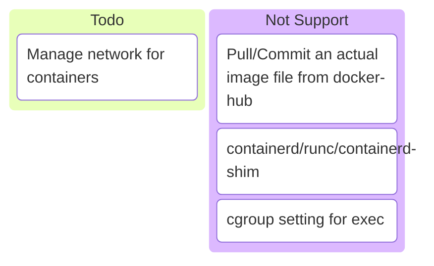
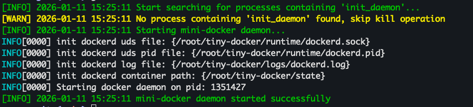
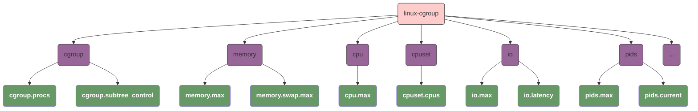
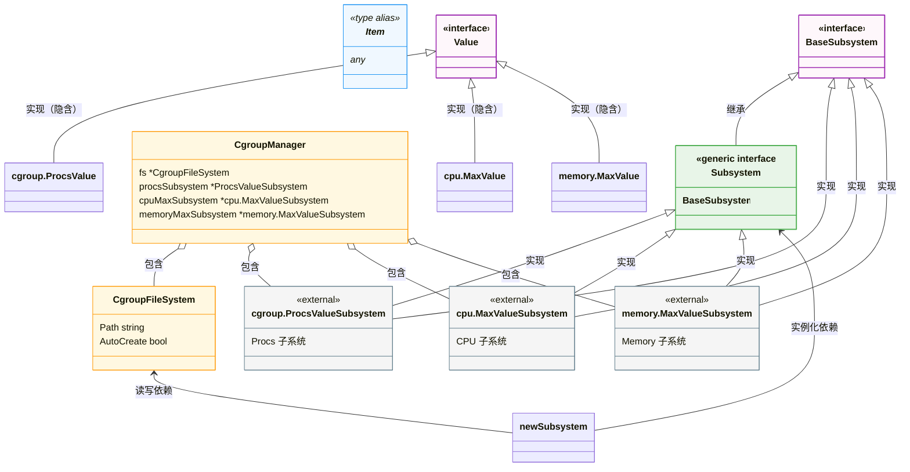
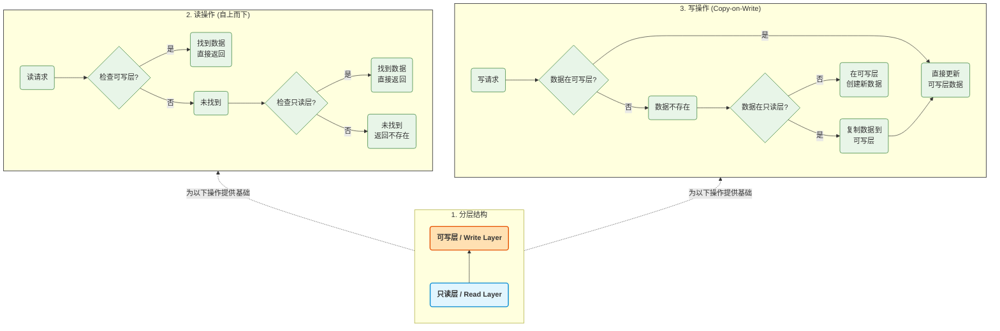
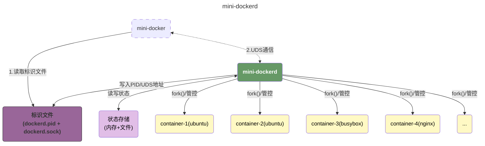
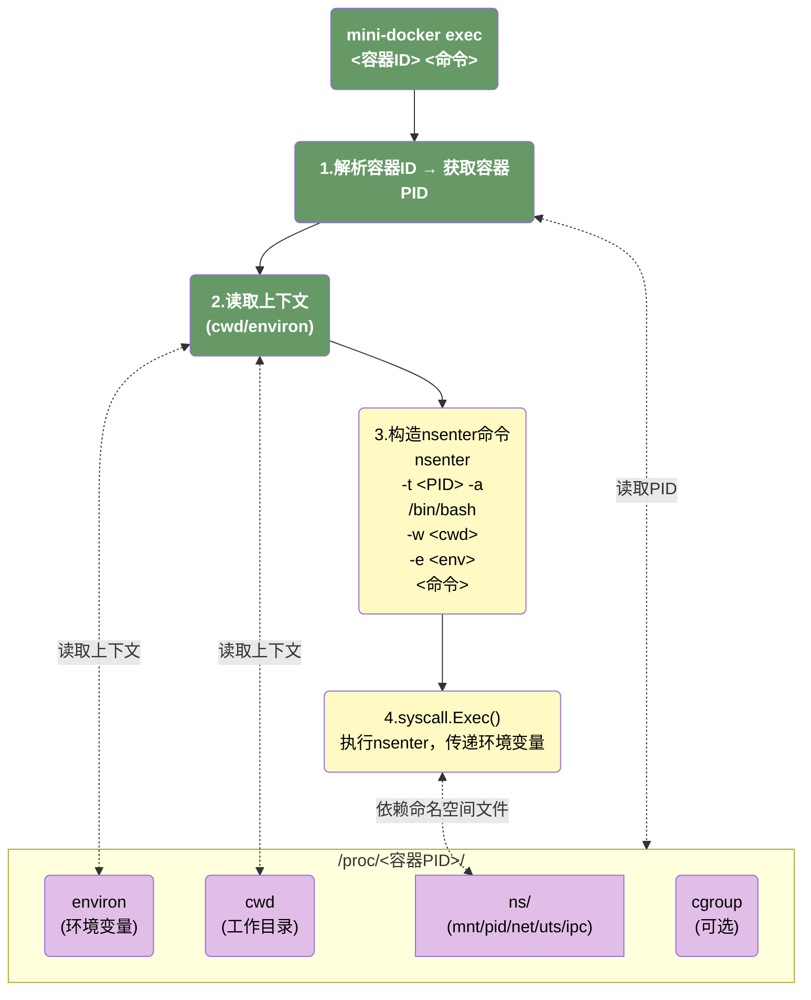

# tiny-docker
> `tiny-docker` is a **toy container engine** that mocks Docker, built from scratch to replicate the core functionality of Docker in a lightweight form factor. 
>
> It is built on Go 1.23.4, allowing us to leverage more modern language features that simplify this lightweight project.


https://github.com/user-attachments/assets/180a38ca-d723-49d7-bd02-bd6fb5052f72


# description




# Usage

## 1. Prepare Image

We have to prepare a runnable image because `tiny-docker` does not support pulling images from Docker Hub yet. Luckily, `docker export` is a convenient option for creating a image.

```bash
docker run -itd ubuntu /bin/bash # pull image from docker hub
# bdd68ffc0bee1f72367474f95e93a98a8fcd318033ec6982e696e26623c25a17
docker export -o /tmp/linux.tar bdd68ffc0bee1f72367474f95e93a98a8fcd318033ec6982e696e26623c25a17
# now we have a linux.tar that can be used as our image

docker run -d busybox top -b
# 553accaf523abbedd50195bd85173b714e10bb31c5e2995d4e28b7e28d5b88b8
docker export -o /tmp/busybox.tar 553accaf523abbedd50195bd85173b714e10bb31c5e2995d4e28b7e28d5b88b8
```

## 2. Running mini-dockerd

`mini-dockerd` is responsible for managing, deploying containers, and many other operations. So we should start it first.

```bash
git clone https://github.com/0x822a5b87/tiny-docker.git /tmp/tiny-docker && cd /tmp/tiny-docker

cd src

go build -o mini-docker . && ./restart_daemon.sh
```



## 3. Play with mini-docker

### Start Containers

Start a Linux container from `/tmp/linux.tar`, which we exported a few minutes ago.

```bash
./mini-docker run -d /tmp/linux.tar -- /bin/sh -c "while true; do sleep 1; done"
```

Start another Linux container with `environment`, `cgroup limit`.

```bash
./mini-docker run -d \
	-e PATH=/bin/ \
	-e name=mini-docker-linux \
	-m 2000m \
	-c '10000 100000' \
	/tmp/linux.tar \
	-- /bin/sh -c "while true; do sleep 1; done"
```

Start a busybox container from `/tmp/busybox.tar`.

```bash
./mini-docker run -d \
	-e PATH=/bin/ 
	-e name=mini-docker-busybox \
	-m 128m \
	-c '100000 100000' \
	/tmp/busybox.tar \ 
	-- /bin/ash -c "while true; do sleep 1; done"
```

### Manage containers

#### ps

```bash
./mini-docker ps
```

This command will show all running containers:

```
CONTAINER ID                      IMAGE    COMMAND                                       CREATED        STATUS            NAMES
26992886d8d94ab6bc3b5a9668afd46f  linux    "/bin/sh -c while true; do sleep 1; done"     8 minutes ago  Up 8 minutes ago  linux
9195b42c32f54b39a682b3294d188e12  busybox  "/bin/ash -c while true; do sleep 1; done"    6 minutes ago  Up 6 minutes ago  busybox
adc1dd03f37d4c8ba003b356e168d048  linux    "-- /bin/sh -c while true; do sleep 1; done"  2 minutes ago  Up 2 minutes ago  linux
```

#### stop

```bash
./mini-docker stop adc1dd03f37d4c8ba003b356e168d048

./mini-docker ps
#CONTAINER ID                      IMAGE    COMMAND                                     CREATED         STATUS             NAMES
#9195b42c32f54b39a682b3294d188e12  busybox  "/bin/ash -c while true; do sleep 1; done"  9 minutes ago   Up 9 minutes ago   busybox
#26992886d8d94ab6bc3b5a9668afd46f  linux    "/bin/sh -c while true; do sleep 1; done"   11 minutes ago  Up 11 minutes ago  linux

./mini-docker ps -a
#CONTAINER ID                      IMAGE    COMMAND                                       CREATED         STATUS                        NAMES
#26992886d8d94ab6bc3b5a9668afd46f  linux    "/bin/sh -c while true; do sleep 1; done"     11 minutes ago  Up 11 minutes ago             linux
#9195b42c32f54b39a682b3294d188e12  busybox  "/bin/ash -c while true; do sleep 1; done"    10 minutes ago  Up 10 minutes ago             busybox
#adc1dd03f37d4c8ba003b356e168d048  linux    "-- /bin/sh -c while true; do sleep 1; done"  5 minutes ago   Exited (0) a few seconds ago  linux
```

#### exec

```bash
./mini-docker exec -it 26992886d8d94ab6bc3b5a9668afd46f /bin/bash
```

This command allow us to enter a running container by `nsenter`.

```
root@VM-0-10-opencloudos:/# ls
bin  boot  dev	etc  home  lib	lib64  media  mnt  opt	proc  root  run  sbin  srv  sys  tmp  usr  var
```

#### others

Additionally, some core features of Docker are also supported:

-   `commit`
-   `logs`

# structure

## cgroup



## cgroup abstraction



## UnionFS



## mini-dockerd



## exec



# references

- [A workshop on Linux containers: Rebuild Docker from Scratch](https://github.com/Fewbytes/rubber-docker/tree/master)
- [Linux containers in 500 lines of code](https://blog.lizzie.io/linux-containers-in-500-loc.html)
- [自己动手写docker](https://github.com/xianlubird/mydocker/tree/master)

