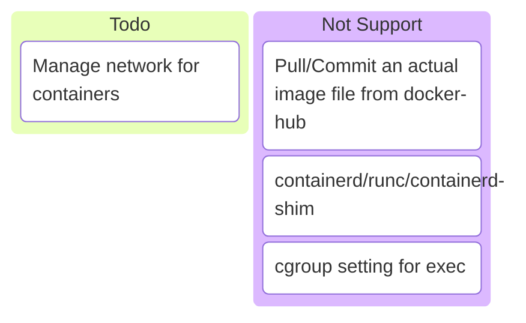
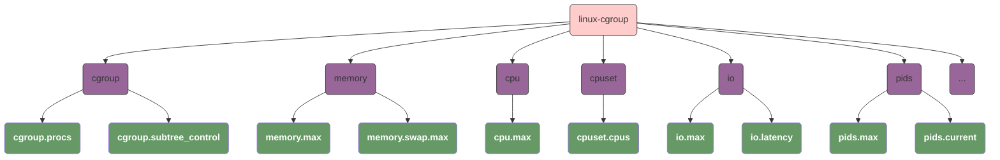
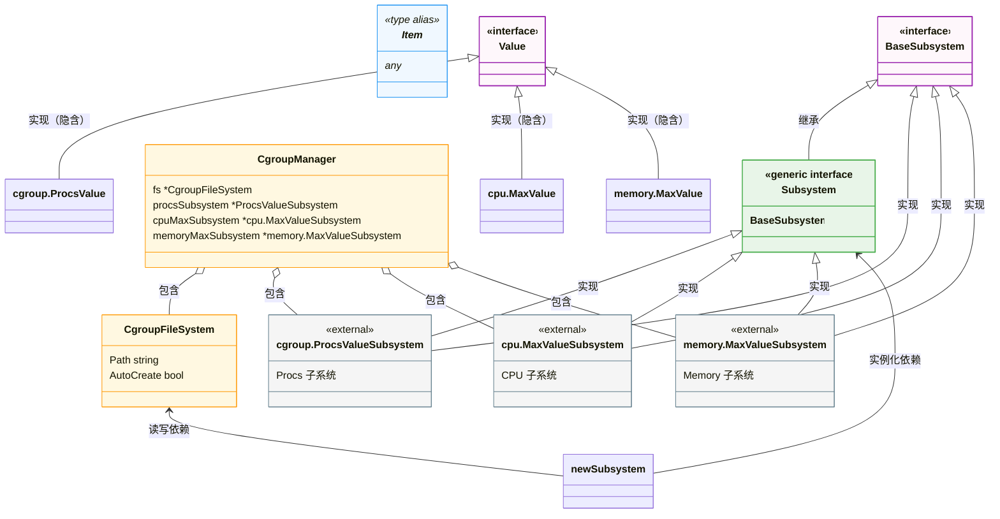
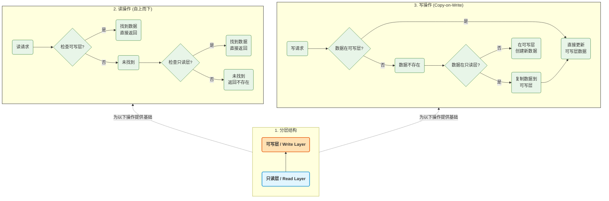
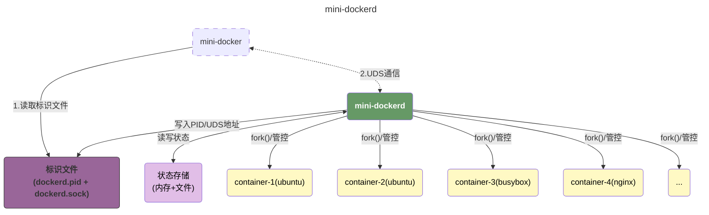
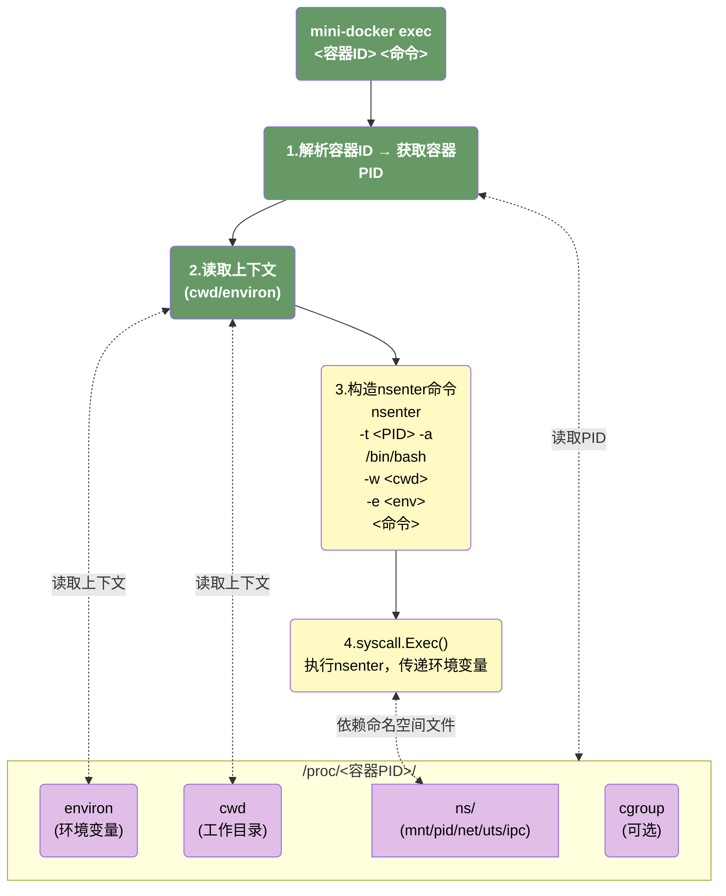

# tiny-docker
> `tiny-docker` is a **toy container engine** that mocks Docker, built from scratch to replicate the core functionality of Docker in a lightweight form factor. 
>
> It is built on Go 1.23.4, allowing us to leverage more modern language features that simplify this lightweight project.

# description

# structure

## cgroup

## cgroup abstraction

## UnionFS

## mini-dockerd

## exec

# references

- [A workshop on Linux containers: Rebuild Docker from Scratch](https://github.com/Fewbytes/rubber-docker/tree/master)
- [Linux containers in 500 lines of code](https://blog.lizzie.io/linux-containers-in-500-loc.html)
- [自己动手写docker](https://github.com/xianlubird/mydocker/tree/master)

